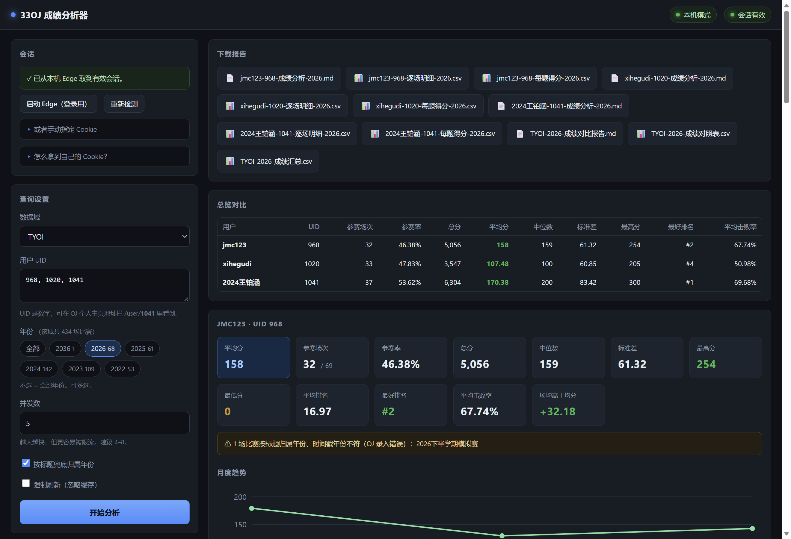

# 33OJ 成绩分析器

输入一个 UID，自动抓取该用户在 [33OJ](https://oj.33dai.cn/) 任意数据域、**任意年份**的比赛成绩，
输出平均分、排名、月度趋势、题位表现，并支持多人横向对比与报告导出。



**零第三方依赖**，只需要 Node.js ≥ 22。所有平台配置（Docker / Render / Fly.io / Railway / GitHub Pages）已随仓库提供。

---

## 快速开始

### 本地运行（推荐，功能最全）

不用填任何凭据 —— 会话从你本机已登录的 Edge 自动获取。

```bat
git clone https://github.com/WangNoNo666/33oj-score-analyzer.git
cd 33oj-score-analyzer

start-edge.cmd            :: ① 启动一个带调试端口的 Edge，在弹出的窗口里登录一次
启动-OJ成绩分析器.cmd      :: ② 打开图形界面
```

界面里填 UID（支持多个，逗号分隔）、勾选年份、点「开始分析」即可。
想放桌面就双击 `创建桌面快捷方式.cmd`。

### 命令行

```bat
run.cmd 1041                              :: 默认 TYOI 域 + 今年
run.cmd 968 --years 2024-2026             :: 多年份
run.cmd 1020 --years all --out ./out/xhq  :: 全部年份

node oj-multi.mjs 968 1020 1041 --years 2026   :: 多人对比
```

| 选项 | 说明 | 默认 |
|---|---|---|
| `--domain <名>` | 数据域：`TYOI` `GXOI` `XZOI` `JDOI` `BHOI` `TEST33` | `TYOI` |
| `--years <年[,...]>` | `2026` / `2024,2025` / `2024-2026` / `all` | 当年 |
| `--out <目录>` | 输出目录 | `./out/…` |
| `--concurrency <n>` | 并发抓取数 | `5` |
| `--no-cache` | 忽略缓存强制重抓 | 关 |
| `--no-title-year` | 不按标题兜底归属年份 | 关 |
| `--json` | 额外输出完整 JSON | 关 |

### 在线部署

后端可以部署到任何支持 Docker 的平台，前端继续放在 GitHub Pages 上。
**完整的分步教程见 [部署指南](部署指南.md)**（GitHub + Render，全免费）。

```bash
# Render：直接读 render.yaml，一键部署
# Fly.io：fly launch --no-deploy && fly deploy
# Railway：读 railway.json
docker build -t 33oj . && docker run -p 8788:8788 33oj   # 或自己来
```

关键环境变量：

| 变量 | 说明 |
|---|---|
| `OJ_MODE=cloud` | 在线模式：不依赖本机 Edge，由用户在页面上填自己的 Cookie |
| `OJ_ALLOW_ORIGIN` | 允许跨域的前端地址，例如 `https://yourname.github.io` |
| `PORT` | 监听端口（多数平台会自动注入） |
| `OJ_JOB_TTL_MS` | 作业与产物保留时长，默认 2 小时 |

前端也可以用 `https://your-pages/?api=https://your-backend` 指定后端，或在界面上直接填。

---

## 功能

| 模块 | 内容 |
|---|---|
| **总览** | 参赛场次、参赛率、总分、平均分（三种口径）、中位数、标准差、最高/最低分、零分场次 |
| **排名** | 平均/最好/最差排名、平均击败率、场均与全场平均分的差值 |
| **分年份** | 多年份时的「分年份 × 分用户」平均分对照表 + 柱状图 |
| **月度趋势** | 每月场次、总分、平均分、最高分、平均排名 + 折线图 |
| **题位表现** | 把各场 T1/T2/… 对齐，算「相对全场」倍率，定位强项与弱项 |
| **逐场明细** | 每场得分、排名、参赛人数、全场均分/中位数/最高、与均分差、击败率 |
| **未参加 / 不可用** | 单独列出，不计入统计 |

导出格式：Markdown 报告 + 逐场明细 CSV + 每题得分 CSV + 多人对比报告/对照表/汇总 CSV。

---

## 指标口径

| 指标 | 含义 |
|---|---|
| **平均分（按参赛场次）** | 总分 ÷ 实际参赛场次。**主口径** |
| 平均分（含缺席） | 总分 ÷ 范围内全部比赛数，未参加按 0 计 |
| 平均分（仅有成绩表） | 排除成绩表拿不到的场次（多为未结束或被锁） |
| 参赛率 | 参赛场次 ÷ 范围内比赛总数 |
| 击败率 | `(参赛人数 − 排名 + 1) ÷ 参赛人数`，跨场可比 |
| 场均高于均分 | 每场「我的分数 − 全场平均分」的平均值 |
| 题位表现 | 只按**题位顺序**对齐，各题标题每场不同，不代表同一道题 |

### 年份归属规则

优先用比赛的 `beginAt`；如果时间戳年份不在所选范围内、但**标题里出现了所选年份**，
则按标题归属并标注 ⚠。33OJ 上确实存在把「2026下半学期模拟赛」录成 **2036** 年的情况。
这类比赛不参与月度趋势统计，可以用 `--no-title-year` 关闭兜底。

---

## 安全说明

**服务器不保存任何凭据。** 在线模式只做代理：拿你提供的 Cookie 去请求 `oj.33dai.cn`，
请求结束即丢弃，不写磁盘、不写日志（异常信息里的 Cookie 也会被正则打码）。
产物写在系统临时目录，`OJ_JOB_TTL_MS` 到期后自动删除。页面侧只放在 `sessionStorage`，关标签页即失效。

**但 Cookie 等同于登录凭证。** 填给任何第三方服务之前都该想清楚 ——
更稳妥的做法是[本地运行](#本地运行推荐功能最全)。用完随时可以在 OJ 上退出登录使其失效。

---

## 实现要点

**会话获取。** 33OJ 的 `TYOI` 等域是私有域，必须登录。而 Edge 使用 **App-Bound Encryption (v20)**
保护 Cookie —— 密钥只在 Edge 进程内可解密，把 `Cookies` 文件复制到别的配置目录也解不开
（这一点是实测确认的）。所以本机模式通过 **DevTools 协议**向运行中的 Edge 索取 Cookie；
在线模式则让用户自己提供。

**自适应限流。** OJ 在请求过快时会返回 **403**（不是永久封禁，稍等即恢复）。
客户端做了三件事：所有请求共用一个发送时隙匀速放行；短时间内多次 403 判定为被限流并指数退避；
同一个地址反复 403 则判定为「这张成绩表本来就锁着」，不再拖慢全局。
失败结果**不写缓存**，否则会把「不可用」在 TTL 内一直读下去，把统计悄悄算错。

**界面。** 原生 HTML/CSS/JS + 手写 SVG 图表，同一套代码既能被后端托管，也能单独部署到 Pages
（跨域时自动从 SSE 切换为轮询，因为 `EventSource` 无法携带自定义请求头）。

---

## 目录结构

```
启动-OJ成绩分析器.cmd   图形界面启动器
创建桌面快捷方式.cmd
start-edge.cmd          启动带调试端口的 Edge
run.cmd                 命令行入口

oj-user.mjs             单用户 CLI
oj-multi.mjs            多用户 CLI
start-edge.mjs          启动 Edge（真正干活的那个）
make-shortcut.mjs       创建桌面快捷方式

app/server.mjs          本地/在线服务（零依赖）
app/ui/                 界面（HTML / CSS / JS）

lib/auth.mjs            会话获取（CDP / 用户提供）与校验
lib/scrape.mjs          HTTP + 自适应限流、比赛列表与成绩表解析、缓存
lib/years.mjs           年份解析与归属
lib/analyze.mjs         统计计算与 Markdown 渲染
lib/job.mjs             作业引擎（界面与命令行共用）

test/selftest.mjs       纯函数自测（不联网，CI 里跑）
site/                   GitHub Pages 落地页
.github/workflows/      CI + Pages 部署
Dockerfile …            Render / Fly.io / Railway 配置
```

---

## 常见问题

**「Edge 未连接」/「DevTools 端口无响应」**
带调试端口的 Edge 没在运行。双击 `start-edge.cmd` 后保持窗口开着。
注意：**日常使用的普通 Edge 无法复用**（没开调试端口，且 Cookie 受 ABE 保护）。

**「需要登录」/「Cookie 无效或已过期」**
在弹出窗口里重新登录 `oj.33dai.cn`，或重新复制 `sid` 与 `sid.sig`。

**某个用户的参赛场次比预期少**
看报告里的「成绩表不可用」一节。通常是比赛未结束、成绩表被锁，或恰好被限流。
勾选「强制刷新」重跑一次一般就好。

**数据不对 / 缺比赛**
加 `--no-cache`。缓存默认 15 分钟。

**端口被占用**
会自动顺延到下一个可用端口，控制台会打印实际地址。

---

## 数据来源与免责
数据来自 [oj.33dai.cn](https://oj.33dai.cn/)（33OJ，Hydro 内核）公开可读的成绩页面。
本项目只是把页面整理成便于分析的报表，不存储、不传播用户数据，与 33OJ 官方无关。

## License

[MIT](LICENSE)
